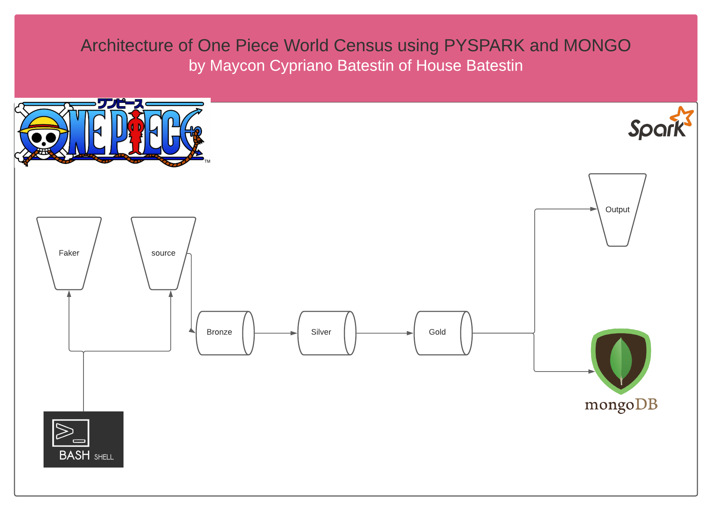
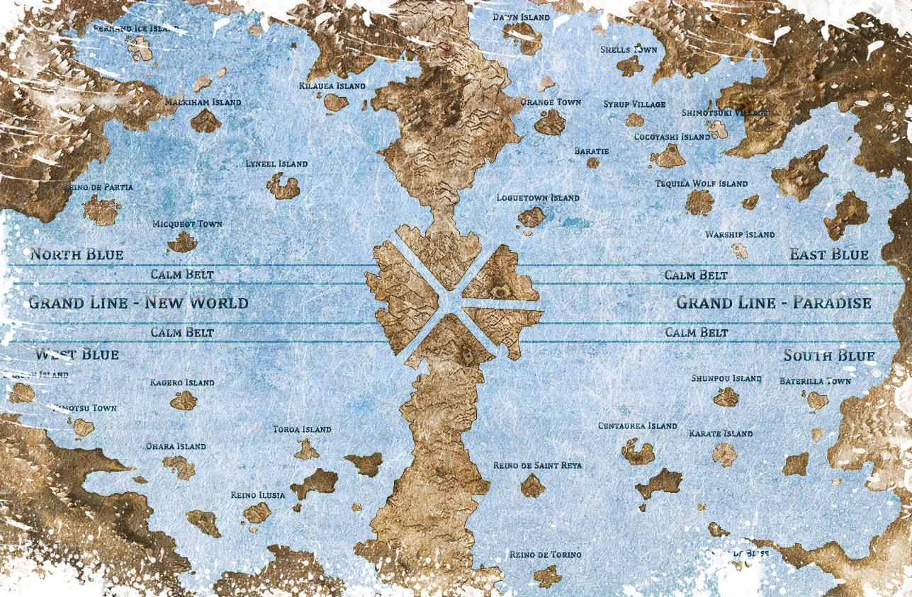

<h1 align="center">


<h3> <p align="center">BIGDATA SIMULATION ONE PIECE WORLD CENSUS </p> </h3>
<h3> <p align="center"> ================= </p> </h3>

>> <h3> Solution Architecture </h3>




>> <h3> Description </h3>
-------------------------

<p> ONE PIECE is a Japanese manga of great international success. The story turns inhabited in a fictional world, tells the adventures of a young man whose body gained rubber properties after accidentally eating a devil fruit (AKUMA NO MI).
In this universe there are three types of AKUMA NO MI; Logia, Zoan and Paramecia. Each has a characteristic. The Logia type are elements that can modify the body, the Zoan are of the animal type (and can be extinct or not) and Paramecia are of the object type. These powers may or may not represent a danger to society, all that pose a danger to society are considered criminals and, varying the type of crime, are announced with a reward.
The government always seeks to collect its taxes.
So in this BigData project we explore the census of this population. Imagining a population of at least 100,000.00 inhabitants, we wrote a project that has MONGODB as its final repository, a non-relational database that organizes its documents by Collections.
Below is a glossary of data.</p>

>> <h3> Glossary of Data </h3>
------------------------------

Fields	                                                  | Type  	  |    Description                              |
----------------------------------------------------------|:---------:|:-------------------------------------------:|
_id                          							  |string 	  | undescore ID                                |
region_birth											  |string     | region of birth                             |
country_birth   										  |string     | country of birth                            |
city_birth												  |string     | city_birth                                  |
current_region											  |string     | current region                              |
current_country											  |string     | current country                             |
current_city											  |string     | current city                                |
street  												  |string     | current street                              |
number													  |string     | number of house                             |
postalcode     											  |string     | postal code                                 |
mailer  												  |string     | mailer                                      |
street													  |string     | street name informed                        |
number													  |string     | number of street name informed              |
register_data     										  |string     | date your data was entered into the record  |
type_of_fruit   										  |string     | type of fruit                               |
fruit_name  											  |string     | fruit name                                  |
fruit_category  										  |string     | fruit hazard level                          |
number_times_resurrected								  |string     | number of times that fruit was resurrected  |
job             										  |string     | occupation                                  |
current_job                     	    				  |string     | current job                                 |
contracting_company										  |string     | name of contracting company                 |
start_date              								  |string     | start date in job company                   |
year_working_time       								  |string     | time in year working in company             |
initial_salary  										  |string     | initial salary                              |
current_wage											  |string     | current wage                                |
first_name      										  |string     | first name                                  |
last_name   											  |string     | last name                                   |
gender     												  |string     | gender                                      |
race													  |string     | race of person                              |
birthday        										  |string     | date of birthday                            |
age                 									  |string     | age                                         |
has_disability  										  |string     | have or do not have a disability            |
security_social_number  								  |string     | security social number                      |
phone       											  |string     | phone                                       |
sketch          										  |string     | sketch                                      |
has_tatoo           									  |string     | have or do not have a tatoo                 |
has_scar        										  |string     | have or do not have a scar                  |
has_rewards     										  |string     | have or do not have a rewards               |
devil_fruit_user										  |string     | whether or not you are an akuma no mi user  |
color_hair          									  |string     | color of hair                               |
color_skill                 							  |string     | color of skill                              |
type_of_tatoo           								  |string     | type of tatoo           	                |
where_in_body       									  |string     | where in body is the tatoo     			    |
color_of_tatoo  										  |string     | color of tatoo                              |
scar        											  |string     | where in body is the scar                   |
color_eyes       										  |string     | color of eyes                               |
main_crime      										  |string     | If the person is a criminal. main crime     |
code_crime      										  |string     | code of crime                               |
tax_collected_government								  |string     | tax collected by government                 |
debt_with_government       								  |string     | debt with government                        |
rewards                                                   |string     | rewards                                     |

>> <h3> Description </h3>
-------------------------

<p> For a better view of the world of ONE PIECE, its regions, cities and islands, we put the map created for the world. </p>


>> <h3> Map </h3>
-----------------------------------



>> <h3> Start the Project </h3>
-------------------------

<p> To run the project, you need to install the dependencies located in the "dependencies" folder and in the root of the project, run the shell_script "run_script.sh". </p>


>> <h3> Sample of Payload in Stagin </h3>
-------------------------
> address
```
{
 "_id":"2W1159879A",
 "region_birth":"East Blue",
 "country_birth":"Warship Island",
 "city_birth":"North Wayne",
 "current_region":"East Blue",
 "current_country":"Warship Island",
 "current_city":"East Joshua",
 "street":"Christine Fields",
 "number":"4104",
 "postalcode":"04650",
 "mailer":"mary.east4104@onepiece.com.br",
 "register_data":"20210423"
}
```

> fruit
```
{
 "_id":"3Y6898825C",
 "type_of_fruit":"it does not have",
 "fruit_name":"it does not have",
 "fruit_category":"it does not have",
 "number_times_resurrected":"0",
 "register_data":"20210622"
}
```


> job
```
{
 "_id":"2W1159879A",
 "job":"Freight forwarder",
 "current_job":"YES",
 "contracting_company":"Robinson, Simon and Hernandez",
 "start_date":"1981/11/02",
 "year_working_time":40,
 "initial_salary":4904.0,
 "current_wage":5345.36,
 "register_data":"20210423"
}
```

> persona
```
{
 "_id":"7P1521176A",
 "first_name":"Kristin",
 "last_name":"Smith",
 "gender":"F",
 "race":"Minks",
 "birthday":"1967-03-26",
 "age":"54",
 "devil_fruit_user":"it does not have",
 "has_job":"has",
 "has_tatoo":"it does not have",
 "has_scar":"has",
 "has_disability":"no deficiency",
 "security_social_number":"575-40-5565",
 "phone":"001-985-833-8626x33224",
 "has_rewards":"has",
 "sketch":"https://www.lorempixel.com/350/215",
 "register_data":"20210816"
}
```

> physical_characteristics
```
{
 "_id":"1S6151128X",
 "color_hair":"SeaShell",
 "color_skill":"BLUISH",
 "type_of_tatoo":"it does not have",
 "where_in_body":"it does not have",
 "color_of_tatoo":"it does not have",
 "scar":"Left arm",
 "color_eyes":"SeaShell",
 "register_data":"20210828"
}
```

> rewards
```
{
 "_id":"2W1159879A",
 "ssn_people":"165-53-1723",
 "main_crime":"female violence",
 "code_crime":13,
 "tax_collected_government":37824.56,
 "debt_with_government":31503.56,
 "rewards":961679.94,
 "register_data":"20210423"
}
```

----------------------------------------------
>> <h3> Sample of Payload in Datalake </h3>
-------------------------
> one_piece
>> collection not_fruit_user

```
> db.not_fruit_user.findOne()
{
        "_id" : ObjectId("61a80938f9fae20940d6d7a9"),
        "payload" : {
                "personal_information" : {
                        "first_name" : "Kimberly",
                        "last_name" : "Thompson",
                        "gender" : "F",
                        "race" : "Dwarf",
                        "birthday" : "1996-11-11",
                        "age" : "25"
                },
                "physical_characteristics" : {
                        "has_disability" : "no deficiency",
                        "color_hair" : "Blue",
                        "color_skill" : "WHITE",
                        "scar" : "Back",
                        "color_eyes" : "Blue"
                },
                "social_characteristics" : {
                        "security_social_number" : "740-38-7150",
                        "phone" : "+1-705-306-4346x28383",
                        "sketch" : "https://dummyimage.com/716x261"
                }
        }
}

```
>> collection fruit_user

```
> db.fruit_user.findOne()
{
        "_id" : ObjectId("61a8143e22cbec6d05f38f4e"),
        "payload" : {
                "personal_characteristics" : {
                        "first_name" : "Kenneth",
                        "last_name" : "Brady",
                        "gender" : "M",
                        "race" : "Skypiea",
                        "birthday" : "2000-05-28",
                        "age" : "21"
                },
                "fruit_characteristics" : {
                        "type_of_fruit" : "Logia",
                        "fruit_name" : "Bismuth\t Bismuth\t no Mi",
                        "fruit_category" : "Dangerous",
                        "number_times_resurrected" : "2"
                },
                "job_characteristics" : {
                        "job" : "Swordsman",
                        "current_job" : "YES",
                        "contracting_company" : "Williams, Wilson and Patterson",
                        "start_date" : "1954/09/01",
                        "year_working_time" : "67",
                        "initial_salary" : "4058.0",
                        "current_wage" : "4423.22"
                },
                "physical_characteristics" : {
                        "type_of_tatoo" : "it does not have",
                        "where_in_body" : "it does not have",
                        "color_of_tatoo" : "it does not have",
                        "color_eyes" : "Red",
                        "color_hair" : "Red",
                        "has_disability" : "no deficiency"
                },
                "social_characteristics" : {
                        "security_social_number" : "151-48-5282",
                        "phone" : "+1-842-853-5857",
                        "sketch" : "https://dummyimage.com/428x136"
                },
                "rewards_informations" : {
                        "main_crime" : "Tax evasion",
                        "code_crime" : "9",
                        "tax_collected_government" : 29491.37,
                        "debt_with_government" : "25393.37",
                        "rewards" : "968090.23"
                }
        }
}

```